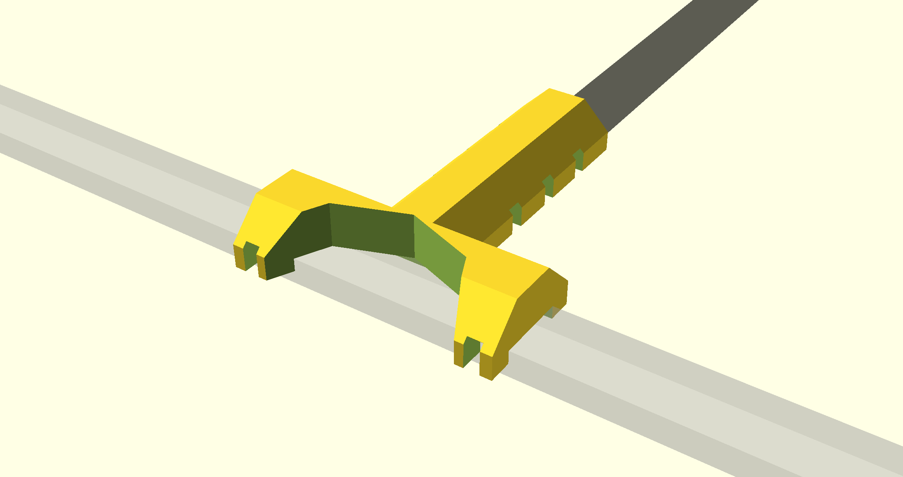

Shield: [![CC BY-NC-SA 4.0][cc-by-nc-sa-shield]][cc-by-nc-sa]
<!-- Thanks to this Guy: https://github.com/santisoler/cc-licenses?tab=readme-ov-file#cc-attribution-noncommercial-sharealike-40-international-->
This work is licensed under a
[Creative Commons Attribution-NonCommercial-ShareAlike 4.0 International License][cc-by-nc-sa].

[![CC BY-NC-SA 4.0][cc-by-nc-sa-image]][cc-by-nc-sa]

[cc-by-nc-sa]: http://creativecommons.org/licenses/by-nc-sa/4.0/
[cc-by-nc-sa-image]: https://licensebuttons.net/l/by-nc-sa/4.0/88x31.png
[cc-by-nc-sa-shield]: https://img.shields.io/badge/License-CC%20BY--NC--SA%204.0-lightgrey.svg

# LED profile holder "Scorpion"

    

The model was designed for producing on a 3D printer.

⚠️ **In case of any questions** – do not hesitate to contact the author in Telegram group ([see below](#contact-me)) and ask.

## HOWTO

⚠️ Before assembling read the topic to the bottom!

This 3D model is highly customizable. So you can configure it for you needs.

### Pre-rendered STL

**TODO add**

### Model Parameters

I used self-explanatory names for OpenSCAD model parameters. But if you still have any questions – [contact me](#contact-me).

### Print Settings

Here is an example of my **printing parameters**:

|Name|Value|Comment|
|--|--|--|
|Nozzle diameter|0.4 mm|0.5, 0.6 and even 1 mm could could also be fine. Try!|
|Layer height/First layer height|0.2 mm||
|Perimeters|3||
|Solid layers - top/bottom|6||
|Fill density|25%|15% should be enough|
|Fill pattern|Cubic||
|Supports|Not needed|The model was designed to be printed without any supports|
|Filament|CoPET(PETG)|ABS would be better because of the profile heating)|

It is just an example. So you can play with yours 🙂. 

It took me a bit more than 2 hours to print on my Graber i3 printer. Printing time depends on kind on printer and the printing parameters. 

### Assembling

**TODO add**

## Contact me
To follow the progress go to my channels:
  - Telegram: [https://t.me/YarickWorkshop](https://t.me/YarickWorkshop/316)
  - YouTube: https://www.youtube.com/@yarick-workshop

Yeah, they both are in Russian.

**If you have any questions** – contact me in either Telegram channel (see above) or Mail: techno.man.983@gmail.com. I can communicate in English without any problems. 

⚠️ **Pay attention**: I do not answer to any comments on YouTube (despite I read them). Why? It is a HUGE secret 🙃
